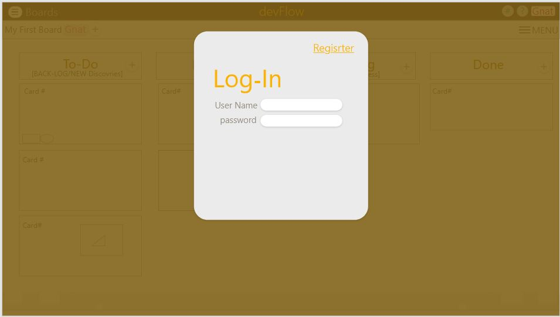

# Perscholas-Dall_NY_SE2020-Mod3-Mod3Project-devFlow
Perscholas Dal/NY 2020 Cohort SE Mod3 Project  -  devFlow  ( A ReactJS Task Management_app with javaCRUD +api ). MVC.  MernStack

# devflow Fullstack Application:
A project Managment App based on Scrunban: 
- [Scruban is a Scrum//Kanban hybrid ]

## Using the following 3rd party APIs:

## Problem statement:
- A task-managment app for delevopers to track leadtimes of projects using Scruban (a combination of Scrum & Kuban Methodologies)
- devflow visually tracks projects using work instances (called Card signals) that moves from left to right (in a work-flow) across work-instances (columns) with fix-capacities (called WIP limits); starting for the "To Do" column  and finishing at the "Done" column. 

## Target users:
Developers, Production Supervisors, Product Managers & Generally, Process Improvement Enthisiasts.

## Wireframe

##### This shows both the overall look of the task managment system

##### The application comes with a firebase based user autherntication

